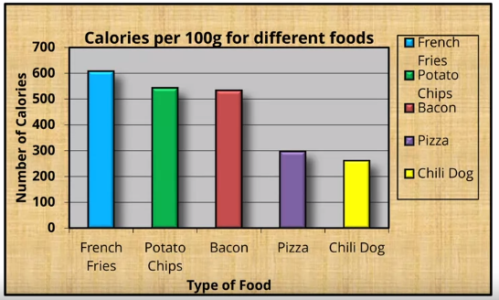
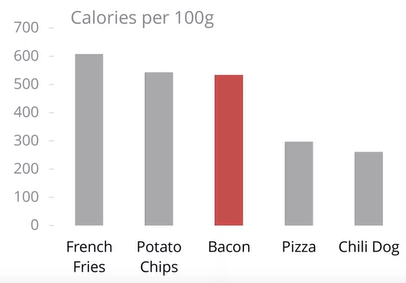
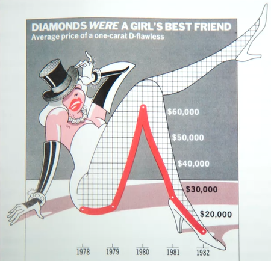
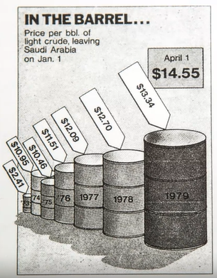

# Graphical Heuristics

**By:** Edward Tufte

## Data-Ink Ratio

The amount of data-ink divided by the total ink required to print the graphic. It should be near 1, because it shows mainly the message that data wants to show. If it is low, it mean there is a lot of junk in the graphic.

- Low

  

- High

  

## Chart Junk

Althought Junk can increase the time and effort of people when seeing your chart, it can help to be memorable.

## Lie Factor

A metric to show the relation between the size of effect shown in a graphic and the size of effect shown in the data.

The size and type of charts used can mislead the decoder.
